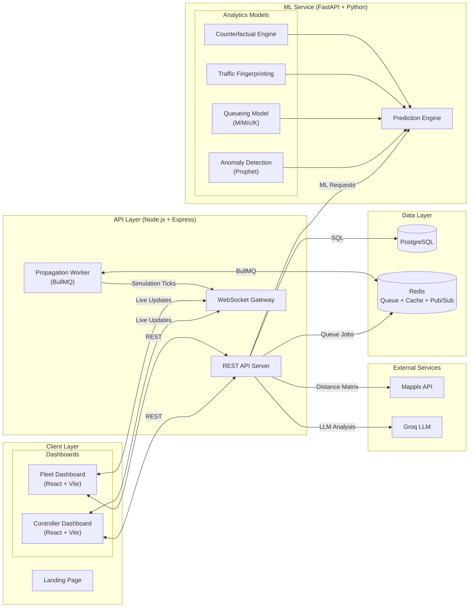
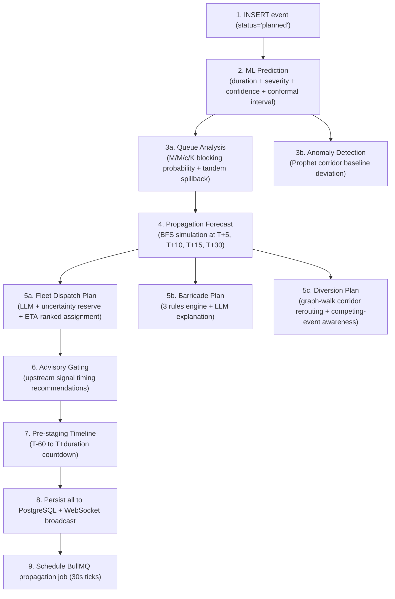
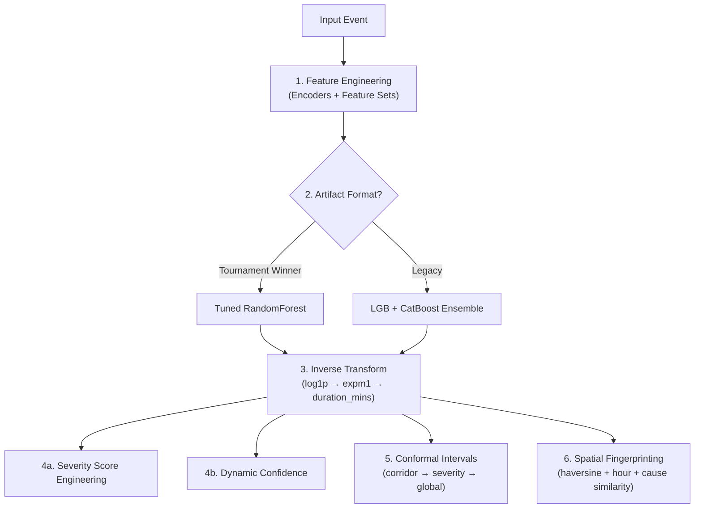
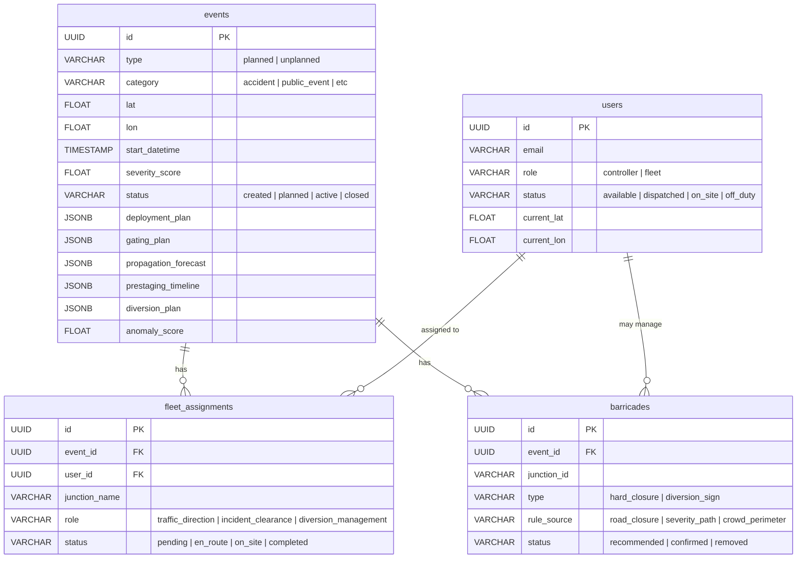
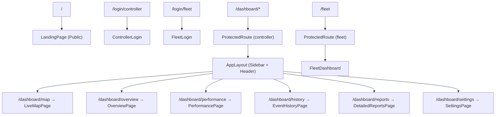
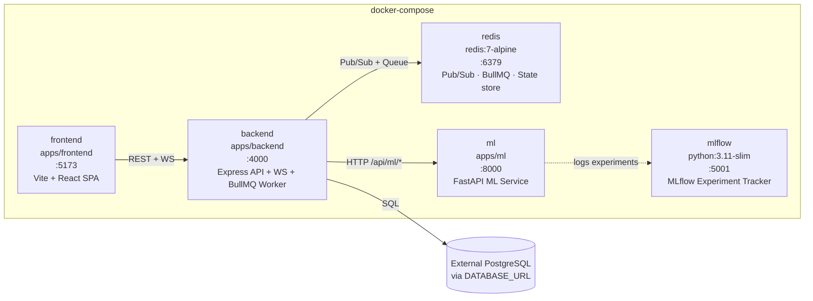
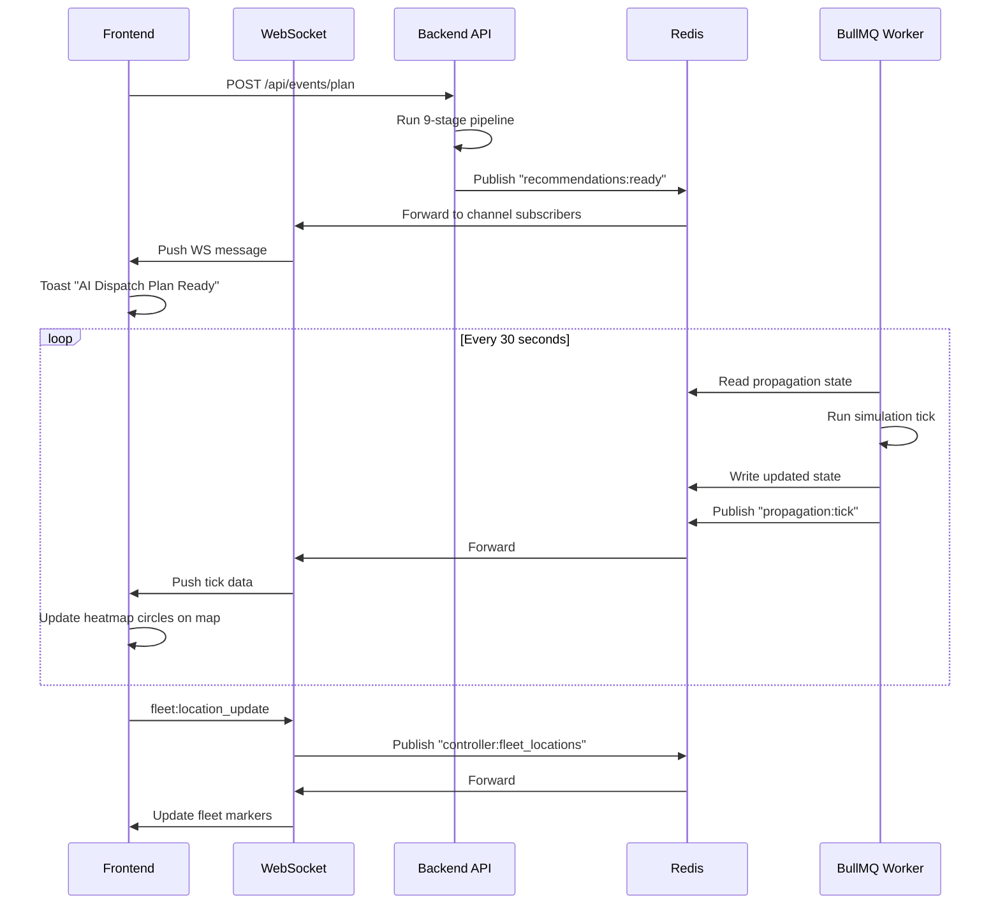

# GridLock — AI-Powered Traffic Command Center

> Predict. Simulate. Intervene. GridLock turns event-driven congestion from a reactive crisis into a managed operation.

---

## Table of Contents

1. [What Is GridLock?](#1-what-is-gridlock)
2. [Key Features](#2-key-features)
3. [System Architecture](#3-system-architecture)
4. [The 9-Stage Planning Pipeline](#4-the-9-stage-planning-pipeline)
5. [Real-Time Propagation Engine](#5-real-time-propagation-engine)
6. [ML Prediction Engine](#6-ml-prediction-engine)
7. [AI Decision Engines](#7-ai-decision-engines)
8. [LLM Integration Layer](#8-llm-integration-layer)
9. [Database Schema](#9-database-schema)
10. [Frontend & User Roles](#10-frontend--user-roles)
11. [Tech Stack](#11-tech-stack)
12. [Infrastructure & Deployment](#12-infrastructure--deployment)
13. [Data Flow & Request Lifecycle](#13-data-flow--request-lifecycle)

---

## 1. What Is GridLock?

GridLock is an AI-powered Traffic Command Center built for urban traffic controllers managing **planned and unplanned events** — concerts, festivals, rallies, accidents, emergency closures.

Standard traffic management is reactive: gridlock forms, then humans respond. GridLock flips this. The moment an event is registered, it triggers a **9-stage automated pipeline** that:

- Predicts congestion **duration and severity** using an ML ensemble
- Simulates congestion **propagation across 294 road junctions** using BFS graph traversal
- Generates a **fleet dispatch plan** with real ETAs via mapping APIs
- Places **barricades** algorithmically at optimal choke points
- Computes **diversion routes** that avoid corridors saturated by competing events
- Runs **every 30 seconds** as a background worker to reflect real-time intervention effects

The system serves two user roles: **Controllers** (command center operators) and **Fleet Members** (on-ground personnel), each with a dedicated dashboard.

---

## 2. Key Features

### Event Management
- Supports **planned events** (concerts, sports, festivals, rallies, construction) and **unplanned events** (accidents, protests, emergency closures)
- Automatic severity classification and anomaly scoring on event creation
- Conflict detection within a **1.5 km radius** to flag spatio-temporal event overlaps

### Congestion Prediction & Simulation
- ML ensemble predicts **event duration and severity** with conformal prediction intervals
- **BFS-based propagation engine** simulates congestion spread across the road graph at T+5, T+15, and T+30 minute horizons
- Live heatmap (🟢 low / 🟡 medium / 🔴 severe) updated every 30 seconds via WebSocket
- **Queue spillback model** (M/M/c/K) computes blocking probabilities and tandem corridor spillover
- **Multi-event gridlock detection**: when two propagating congestion fronts collide, the system flags a merge event and spikes the intensity

### Fleet Dispatch
- LLM-generated dispatch plans, ranked by real ETA from **Mappls Distance Matrix API**
- Uncertainty-aware: reserves contingency fleet members based on prediction confidence intervals
- Dynamic reassignment support as conditions evolve

### Barricade Placement
- Three rule types: **road closure**, **severity-path blocking**, and **crowd perimeter**
- Barricades modeled in the simulation — the propagation engine stops BFS traversal at barricaded nodes
- Deployed fleet members accelerate decay at their assigned junctions (1.5× decay rate)

### Diversion Planning
- Graph-walk corridor rerouting that explicitly avoids corridors already saturated by competing active events
- LLM-generated prose explanations for each diversion route

### AI Chatbot
- Context-aware chatbot (Groq-backed) with full event state in prompt context
- Example queries: *"How many officers for tomorrow's match?"* / *"What if it starts raining during the concert?"* / *"Show me alternate routes for the festival."*

### Ambient AI Engine
- Every 2 minutes (every 4th propagation tick), an LLM-generated radio-style situational report is broadcast to controllers
- Covers active event state, fleet positions, and developing congestion fronts

---

## 3. System Architecture

GridLock is a monorepo with four services: a React frontend, a Node.js/Express backend, a Python FastAPI ML service, and Redis as the shared state and messaging layer.



**External dependencies:**
- **Mappls API** — distance matrix for real-world ETAs used in fleet dispatch ranking
- **Groq LLM** — backs all five LLM-powered services (dispatch, barricades, diversions, ambient sitreeps, chatbot)

### Service Breakdown

| Layer | Technology | Responsibility |
|---|---|---|
| Frontend | React + Vite + TypeScript | Controller & Fleet dashboards, live map, heatmap |
| Backend API | Node.js + Express + TypeScript | REST endpoints, WebSocket gateway, BullMQ orchestration |
| ML Service | Python + FastAPI | Prediction, queueing models, anomaly detection, counterfactuals |
| Cache / Queue | Redis 7 | BullMQ jobs, Pub/Sub for WebSocket fan-out, propagation state store |
| Database | PostgreSQL | Persistent event, user, assignment, and barricade records |
| Experiment Tracking | MLflow | ML model training and experiment logging |

---

## 4. The 9-Stage Planning Pipeline

Every event — planned or unplanned — triggers this pipeline synchronously before returning a response to the controller.



---

## 5. Real-Time Propagation Engine

Once an event is planned, a BullMQ background job fires every 30 seconds and updates the live congestion map.

### What happens each tick
```
Every 30 seconds:
  1. Read propagation state from Redis (current congestion nodes + intensities)
  2. Fetch active interventions (barricades placed, fleet deployed)
  3. Scan all other active events' propagation states → detect multi-event gridlock
  4. Run simulationService.tick():

     For each congested node:
       ├── 5% spread chance × edge weight × current intensity
       ├── Intensity decay = initialSeverity / (durationMins × 2) per tick
       ├── Barricaded nodes: propagation blocked (BFS stops)
       ├── Fleet-deployed nodes: decay accelerated 1.5×
       ├── Intensity ≥ 1.0: guaranteed spread (queue spillback)
       └── Multi-event collision: guaranteed spread + intensity spike

  5. Publish propagation:tick → Redis Pub/Sub → WebSocket → frontend heatmap
  6. Every 4th tick (≈2 min): generate ambient LLM situational report
```

### The Graph

The road network is modeled as an adjacency list of **294 junctions**, with corridor cascade weights encoding the relative risk of congestion spreading along each edge. GraphService handles BFS traversal and is shared by the simulation, fleet dispatch, barricade, and diversion services.

---

## 6. ML Prediction Engine

The ML service (FastAPI, Python) exposes 9 endpoints consumed by the backend.

### Prediction Flow


### ML Prediction Pipeline Architecture

Rather than a simple training loop, the GridLock ML prediction engine executes a highly sophisticated, multi-stage pipeline for every incoming event. 

| Stage | Component | Description | Key Details |
|:---|:---|:---|:---|
| **1** | **Feature Engineering** | Transforms raw event data into a standardized feature matrix. | Spatial `Encoders`, Target & WOE Encoding, PCA, Interaction terms. |
| **2** | **Model Selection & Inference** | Evaluates artifact format and routes to the appropriate model. | **Tournament**: Tuned RandomForest<br>**Legacy**: LGB + CatBoost blend. |
| **3** | **Inverse Transformation** | Translates stable logarithmic predictions back to real minutes. | `log1p` → `expm1` → `duration_mins`. |
| **4** | **Severity & Confidence** | Synthesizes an index and penalizes uncertainty. | **Severity**: Normalizes event/network stats.<br>**Confidence**: Ensemble variance penalty. |
| **5** | **Uncertainty Calibration** | Computes rigorous prediction bounds via Conformal Intervals. | Cascades: Corridor → Severity → Global fallback. |
| **6** | **Explainability** | Retrieves statistically similar historical precedents via KNN. | Matches on haversine distance, hour of day, and cause. |

### Pipeline Outputs & Metrics

| Stage | Metric / Output Generated |
|---|---|
| **1. Feature Engineering** | `X_full` (Standardized Feature Matrix) |
| **2. Core Inference** | `log_duration` (Raw ensemble prediction) |
| **3. Inverse Transformation**| `duration_mins` (Predicted event duration in minutes) |
| **4. Severity & Confidence** | `severity_score` (0-100 index), `confidence` (Percentage %) |
| **5. Uncertainty Calibration** | `lower_bound_mins`, `upper_bound_mins` (Rigorous confidence interval) |
| **6. Explainability** | `similar_events` (Array of K-nearest historical precedents) |

### ML Service Endpoints

| Endpoint | Model / Algorithm | Output |
|---|---|---|
| `POST /api/ml/predict` | A tuned RandomForest, selected via a model tournament + conformal intervals + fingerprinting | duration, severity, confidence, interval, similar events |
| `POST /api/ml/repredict` | Live re-estimation using elapsed time + conformal interval | updated prediction for active events |
| `POST /api/ml/queue-analysis` | M/M/c/K queueing + tandem corridor analysis | blocking_probability, risk_level, spillover_time |
| `POST /api/ml/deployment` | Greedy knapsack resource allocation | optimized resource deployment plan |
| `POST /api/ml/gating` | Advisory green-time reduction rules | signal timing recommendations |
| `POST /api/ml/anomaly` | Prophet corridor baselines + adaptive thresholds | anomaly_score, anomaly_label |
| `POST /api/ml/counterfactual` | What-if policy regret computation | counterfactual outcome estimates |
| `POST /api/ml/accuracy` | Prediction accuracy tracking | historical accuracy metrics |
| `POST /api/ml/train-baselines` | Retrain Prophet corridor models | training job trigger |
---

## 7. AI Decision Engines

The backend hosts six core services that power the planning pipeline. Each runs deterministic rule logic first; the LLM only adds prose explanations or JSON structure on top.

| Service | What it does | LLM role | Fallback |
|---|---|---|---|
| **GraphService** | 294-junction adjacency list, BFS, corridor cascade weights | None | — |
| **SimulationService** | Tick-based BFS spread + decay + interventions | None | — |
| **RecommendationService** | Fleet dispatch: ETA ranking + uncertainty reserve | Generates dispatch JSON | Escalation-tier rules + ETA ranking |
| **BarricadeService** | 3 rule types: road closure / severity path / crowd perimeter | Writes placement explanations | Rule-based output only |
| **DiversionService** | Graph-walk corridor rerouting, competing-event-aware | Writes route explanations | Graph-walk output only |
| **ConflictService** | Spatio-temporal overlap detection within 1.5 km radius | None | — |
| **AmbientService** | Radio-chatter situational updates every 2 minutes | Generates SITREP prose | Silently skipped |
| **ChatService** | Context-aware AI chatbot | Full LLM response | Returns error message |
| **QueueService** | BullMQ job scheduling, Redis pub/sub publishing | None | — |
| **MapplsService** | Distance matrix API for real ETAs | None | — |

**Design principle:** deterministic rule engines always compute the structural plan. The LLM adds prose, explanations, or formats the output into JSON — it never drives the safety-critical dispatch decision unilaterally.

---

## 8. LLM Integration Layer

All LLM calls go through **Groq**. Each service has a hard deterministic fallback so LLM outages do not interrupt operations.


---

## 9. Database Schema

Four tables. Events carry the full planning output as JSONB columns so all pipeline stages are persisted in a single row update.



---

## 10. Frontend & User Roles

### User Roles

**Controller** — command center operator
- Plan and manage events
- View live congestion heatmap with 30-second refresh
- Review and confirm AI dispatch plans, barricade placements, and diversion routes
- Interact with AI chatbot for scenario queries
- Access analytics, historical event data, and performance reports

**Fleet Member** — on-ground personnel
- View assigned junctions and dispatch instructions
- Update task status (pending → en_route → on_site → completed)
- Report road conditions and incidents in real time
- Update barricade status

### Frontend Routing

```
/                          → Landing Page (public)
/login/controller          → Controller login
/login/fleet               → Fleet login

/dashboard/map             → Live Map (heatmap + event markers)
/dashboard/overview        → Active events overview
/dashboard/performance     → Prediction accuracy + intervention metrics
/dashboard/history         → Historical event log
/dashboard/reports         → Detailed event reports
/dashboard/settings        → System settings

/fleet                     → Fleet Member dashboard
```



---

## 11. Tech Stack

| Layer | Technology |
|---|---|
| Frontend | React, Vite, TypeScript, WebSocket client |
| Backend | Node.js, Express, TypeScript, BullMQ |
| ML Service | Python, FastAPI, LightGBM, CatBoost, scikit-learn, Prophet, MLflow |
| Database | PostgreSQL |
| Cache / Queue / Pub-Sub | Redis 7 |
| LLM Provider | Groq |
| Maps / Routing | Mappls API (distance matrix) |
| Containerization | Docker, Docker Compose |

---

## 12. Infrastructure & Deployment

The full system runs as a single **Docker Compose** stack with five containers:



Service dependencies:
- `frontend` → `backend` (REST + WebSocket)
- `backend` → `ml` (HTTP), `redis` (Pub/Sub + BullMQ), `PostgreSQL` (SQL)
- `ml` → `mlflow` (experiment logging, optional)

---

## 13. Data Flow & Request Lifecycle

### Planning an event (end-to-end)

```
1.  Controller submits event via form
      │
2.  POST /api/events/plan (JWT-authenticated)
      │
3.  INSERT into PostgreSQL → event_id returned
      │
4.  WebSocket broadcast: event:new → all controllers notified
      │
5.  9-stage pipeline runs (see Section 4)
      │
6.  UPDATE 17 columns in PostgreSQL with all pipeline outputs
      │
7.  WebSocket broadcast: recommendations:ready, barricades:ready
      │
8.  BullMQ job scheduled → propagation worker starts 30s ticks
```

### Live propagation (every 30 seconds)

```
BullMQ Worker
  │
  ├── Read state from Redis
  ├── Run simulation tick (spread + decay + interventions)
  ├── Write updated state to Redis
  ├── Publish propagation:tick → Redis Pub/Sub
  │                                     │
  │                             WebSocket Gateway
  │                                     │
  │                             Frontend heatmap update
  │
  └── Every 4th tick: Groq generates ambient SITREP → broadcast
```

### Fleet location updates

```
Fleet member app → WebSocket: fleet:location_update
  │
Redis Pub/Sub: controller:fleet_locations
  │
WebSocket → Controller dashboard: fleet markers updated on map
```



---
