# gridlock_prototype

# GridLock Project 2

An AI-powered Traffic Command Center for forecasting and managing event-driven congestion caused by planned and unplanned events. The system predicts congestion, simulates its propagation across the road network, recommends interventions such as fleet dispatch and barricade placement, and provides an AI assistant for traffic controllers.

---

# Architecture

## 1. High level Architecture

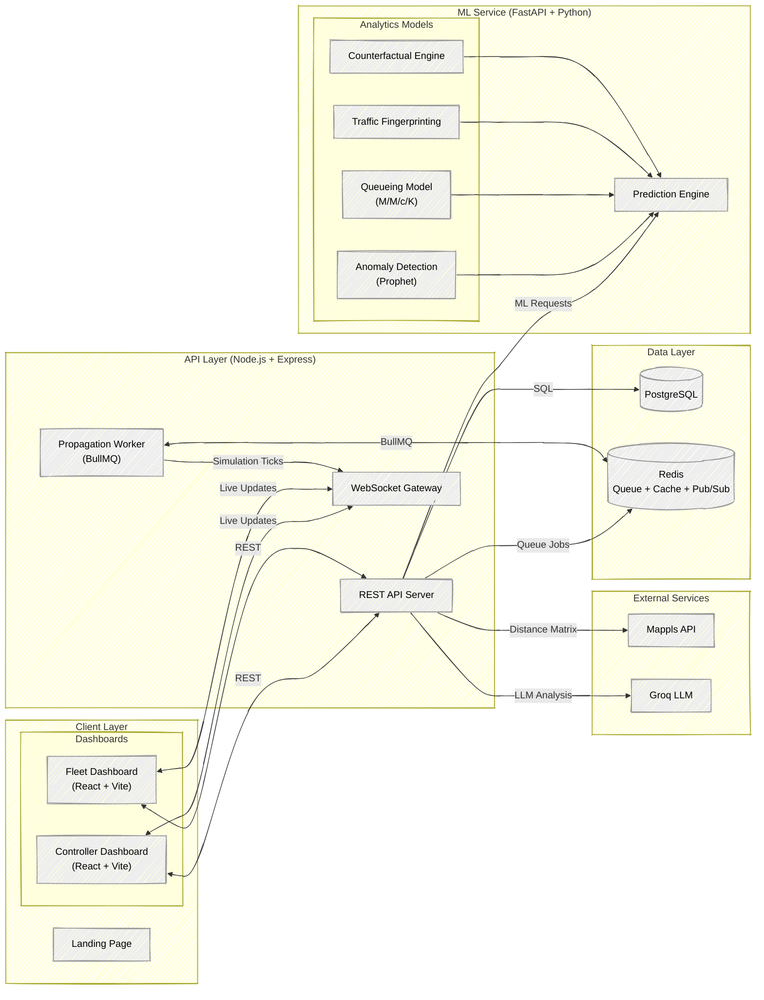

## 2. Infrastructure (Docker Compose topology)

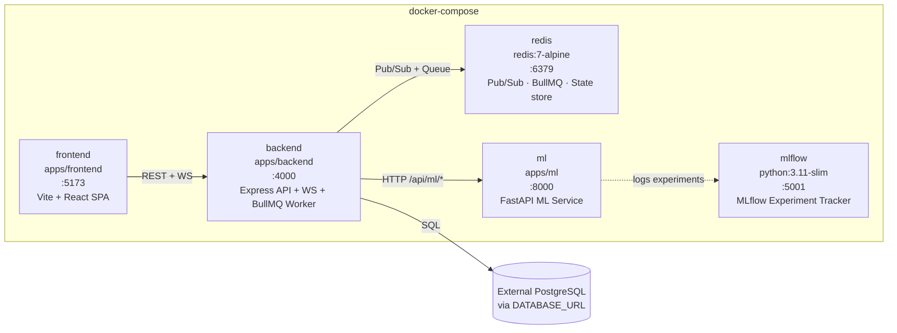

## 3. Database Schema (ERD)

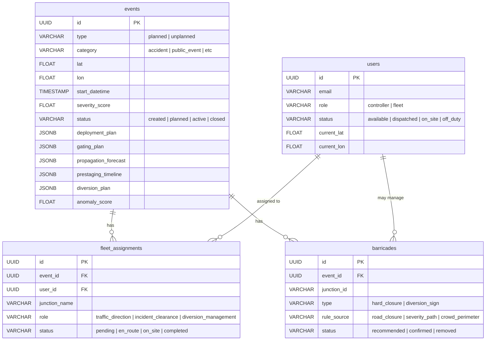

---

## 4. Backend Service Layer

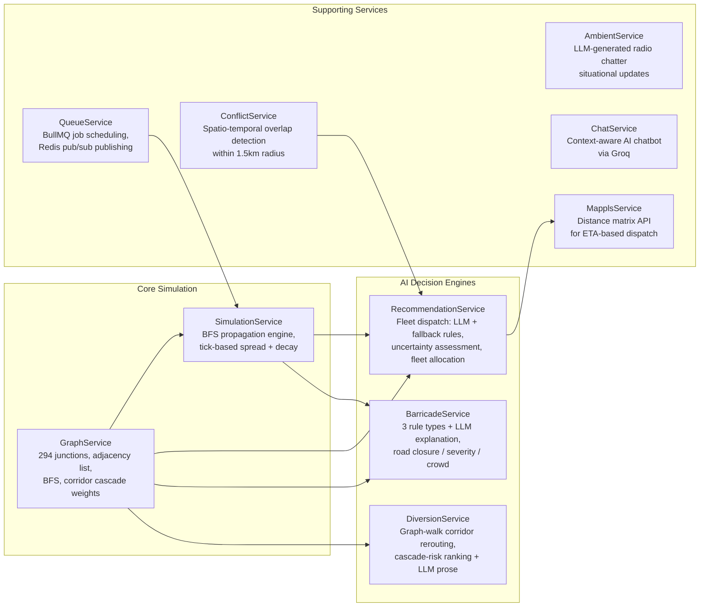

---

## 5. The 9-Stage Planning Pipeline

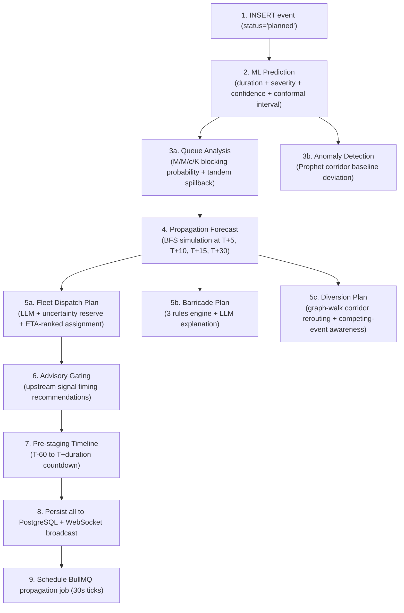

---

## 6. Real-Time Propagation Worker Logic

*(Converted from the prose description in Section 3.6 of the source doc.)*

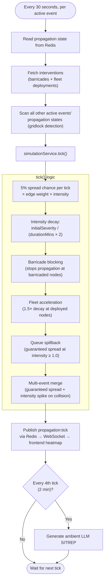

---

## 7. ML Prediction Engine

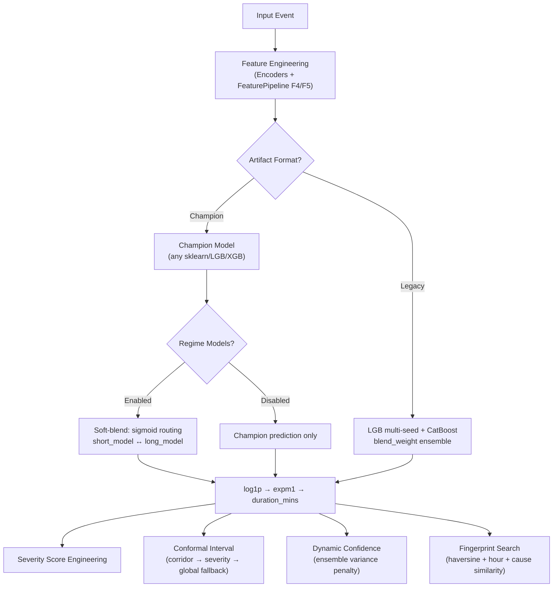

---

## 8. ML Service API Surface

*(Converted from the endpoint table in Section 4.1 of the source doc.)*

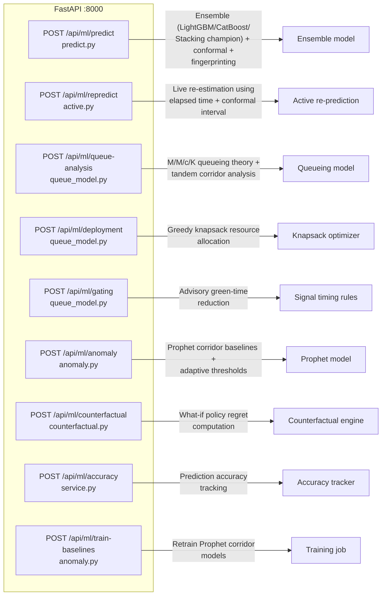

---

## 9. Frontend Routing & Auth

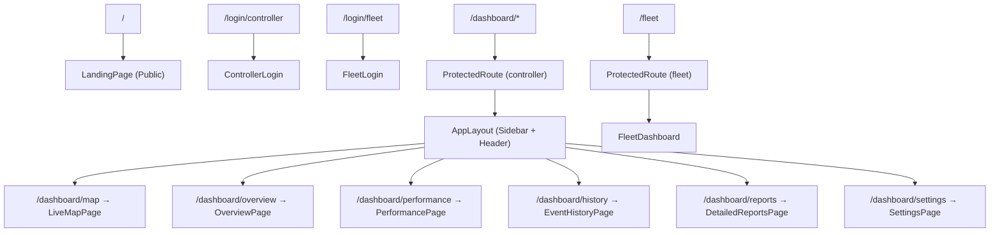

---

## 10. Real-Time Data Flow (Sequence Diagram)

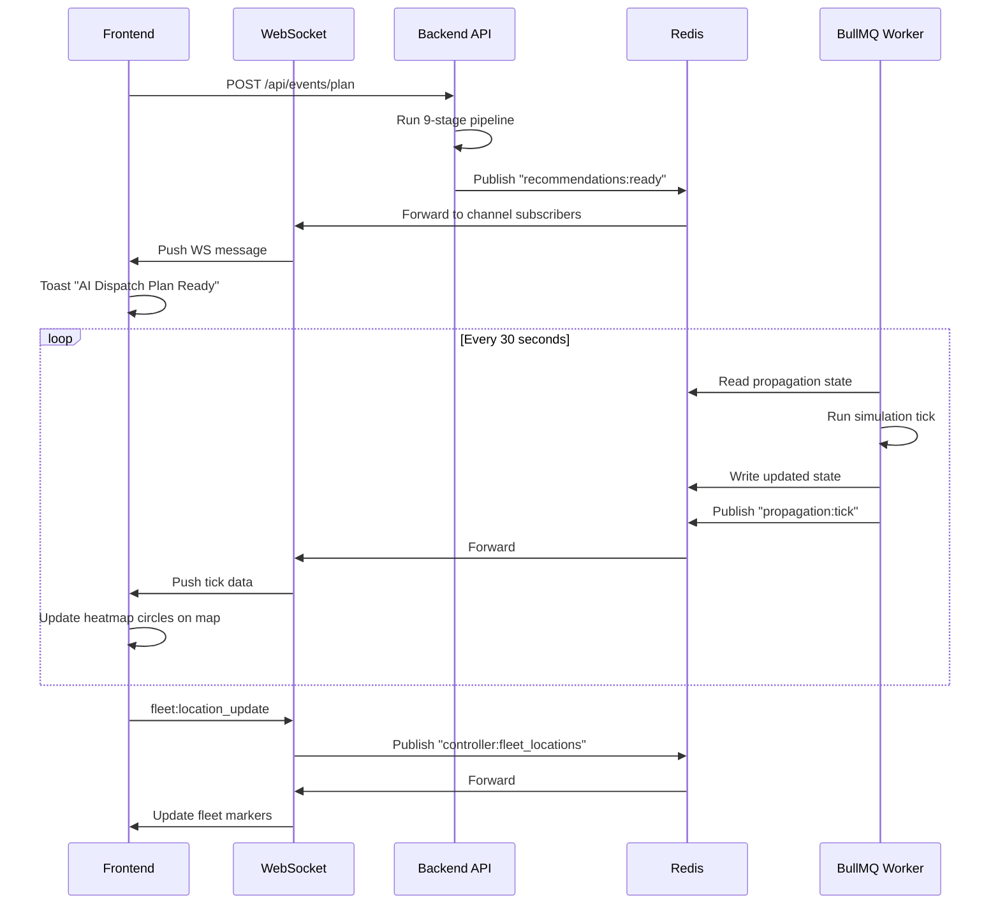

---

## 11. LLM Integration Layer (Groq)

*(Converted from the table in Section 6 of the source doc.)*

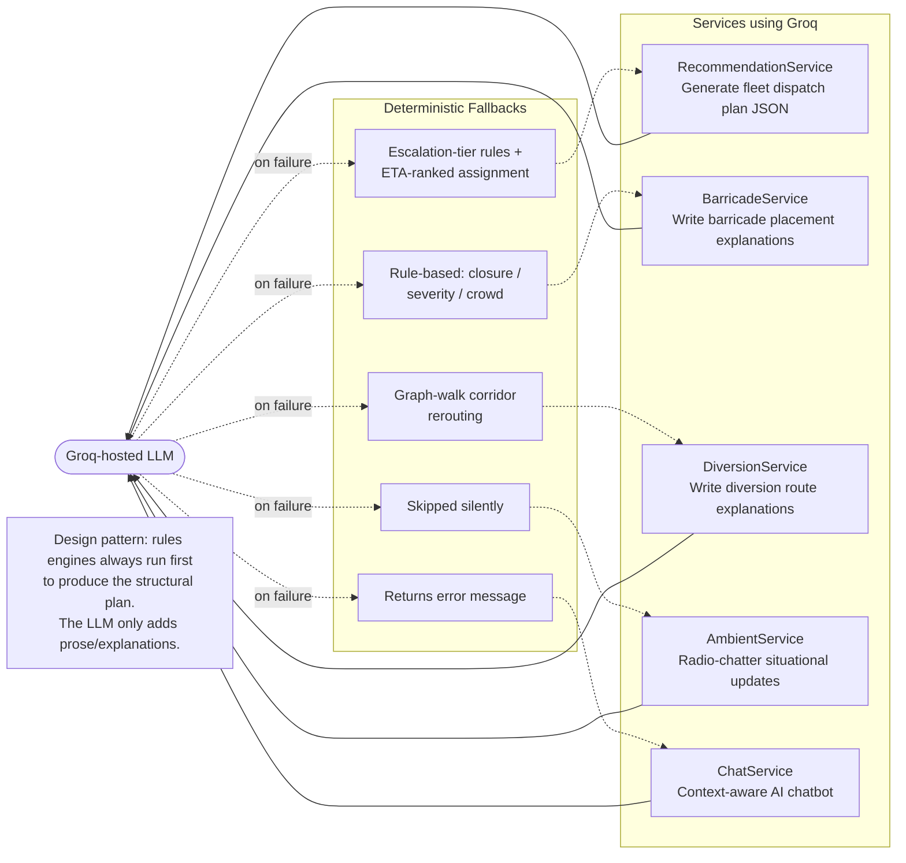

---

## 12. Complete Request Lifecycle

*(Converted from the prose pipeline in Section 8 of the source doc.)*

```mermaid
flowchart TD
    A["User submits event via PlanEventForm"] --> B["POST /api/events/plan<br/>(JWT-authenticated)"]
    B --> C["INSERT into PostgreSQL → event_id"]
    C --> D["WebSocket broadcast: event:new"]
    D --> E["HTTP POST → ML Service /api/ml/predict"]

    subgraph "Prediction"
        E --> E1["Feature engineering<br/>(encoders + pipeline)"]
        E1 --> E2["Champion model predict (log-space)"]
        E2 --> E3["Conformal interval<br/>(corridor → severity → global)"]
        E3 --> E4["Fingerprint search<br/>(k-NN on reference corpus)"]
        E4 --> E5["Returns: duration, severity,<br/>confidence, interval, similar events"]
    end

    E5 --> F["HTTP POST → ML Service /api/ml/queue-analysis"]
    F --> F1["M/M/c/K + tandem queue computation"]
    F1 --> F2["Returns: blocking_probability,<br/>risk_level, spillover time"]

    F2 --> G["HTTP POST → ML Service /api/ml/anomaly"]
    G --> G1["Prophet baseline comparison"]
    G1 --> G2["Returns: anomaly_score, anomaly_label"]

    G2 --> H["SimulationService.getCongestionForecast()"]
    H --> H1["BFS propagation at T+0/T+15/T+30<br/>(no interventions)"]

    H1 --> I["RecommendationService.generateDispatchPlan()"]
    I --> I1["MapplsService.getDistanceMatrix() for real ETAs"]
    I1 --> I2["Groq LLM generates dispatch JSON (or fallback rules)"]
    I2 --> I3["assignNearestFleet() with ETA-based ranking"]
    I3 --> I4["assessUncertainty() → contingency reserve"]

    I4 --> J["BarricadeService.generateBarricadePlan()"]
    J --> J1["3 rules: road_closure + severity_path + crowd_perimeter"]
    J1 --> J2["Groq LLM writes explanations (or fallback)"]

    J2 --> K["DiversionService.generateDiversionPlan()"]
    K --> K1["Graph-walk corridor X, find transfers to corridor Y"]
    K1 --> K2["Avoid corridors used by competing events"]
    K2 --> K3["Groq LLM writes explanations (or fallback)"]

    K3 --> L["callGating() → ML Service /api/ml/gating"]
    L --> L1["Green-time reduction at upstream junctions"]

    L1 --> M["buildPrestagingTimeline()"]
    M --> M1["T-60 to T+duration operational countdown"]

    M1 --> N["UPDATE 17 columns in PostgreSQL"]
    N --> O["WebSocket broadcast:<br/>recommendations:ready, barricades:ready"]
    O --> P["schedulePropagationJob() → BullMQ (30s recurring)"]

    P --> Q["Worker reads state from Redis"]
    Q --> R["Runs tick (spread + decay + interventions)"]
    R --> S["Publishes propagation:tick →<br/>Redis → WebSocket → Map heatmap"]
    S -.->|"loop every 30s"| Q
```

---

## 13. Key Algorithms Map

*(Converted from the algorithm summary table in Section 7 of the source doc.)*

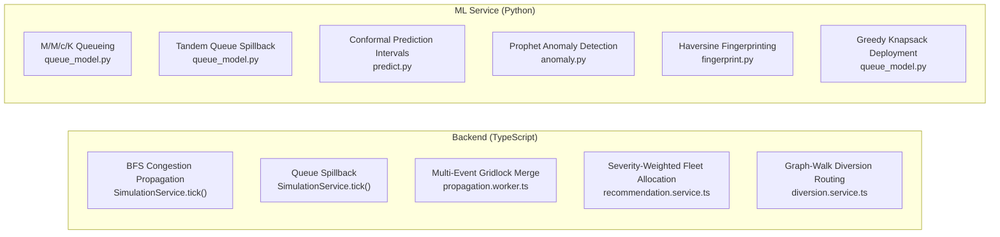


---


# Users

## 1. Controller

Traffic command center operators responsible for:

* Monitoring traffic conditions
* Managing events
* Deploying fleet members
* Placing barricades
* Viewing congestion heatmaps
* Interacting with the AI assistant

## 2. Fleet Member

On-ground personnel responsible for:

* Receiving dispatch instructions
* Viewing assigned routes
* Reporting road conditions
* Updating barricade status
* Sending incident updates

---

# Features

## 1. Role-Based Access Control (RBAC)

### Controller

* Create and manage events
* View analytics and predictions
* Dispatch fleets
* Place barricades
* Access AI chatbot
* View heatmaps and simulations

### Fleet Member

* View assignments
* Update task status
* Report incidents
* Share real-time updates

---

## 2. Ambient AI Engine

Continuously processes:

* Historical traffic data
* Event information
* Fleet updates
* Real-time traffic signals
* Incident reports

Capabilities:

* Background traffic monitoring
* Dynamic congestion prediction
* Automatic intervention recommendations
* Continuous learning from new events

---

## 3. Congestion Propagation Engine

Simulates how traffic congestion spreads across the road network.

### Heatmap Generation

Displays:

🟢 Low congestion

🟡 Medium congestion

🔴 Severe congestion

Predictions for:

* 5 minutes
* 15 minutes
* 30 minutes

---

### Barricade Placement Optimizer

Recommends:

* Optimal barricade locations
* Required number of barricades
* Activation timings

Objective:

Reduce congestion spillover and improve traffic flow.

---

### Fleet Dispatch Engine

Recommends:

* Number of fleet members required
* Deployment locations
* Priority intervention zones
* Dynamic reassignment during incidents

---

## 4. Planned and Unplanned Event Management

### Planned Events

* Festivals
* Sports events
* Political rallies
* Concerts
* Construction activities

### Unplanned Events

* Accidents
* Sudden gatherings
* Protests
* Emergency road closures

The system automatically adjusts recommendations based on event type and severity.

---

## 5. Time-Based Forecasting

Supports traffic forecasting at multiple horizons:

* Real-time
* +5 minutes
* +15 minutes
* +30 minutes
* Event start and end windows

Predictions include:

* Congestion score
* Expected delays
* Affected roads
* Resource requirements

---

## 6. AI Chatbot for Planned Events

Natural language interface for controllers.

Examples:

> How many fleet members are required for tomorrow's concert?

> Which roads will be affected by the cricket match?

> What happens if it starts raining during the event?

> Suggest diversion plans for the festival.

Capabilities:

* Event analysis
* Scenario simulation
* Resource recommendations
* Explainable predictions

---

# Concise System Architecture

```text
                      ┌──────────────────────┐
                      │   Controller UI      │
                      └──────────┬───────────┘
                                 │
                      ┌──────────▼───────────┐
                      │   React + Vite App   │
                      └──────────┬───────────┘
                                 │
                   WebSocket (Real-Time Updates)
                                 │
              ┌──────────────────┴──────────────────┐
              │                                     │
   ┌──────────▼──────────┐              ┌──────────▼──────────┐
   │   API Services      │              │   AI Chat Service   │
   │      (TS)           │              │     LangChain       │
   └──────────┬──────────┘              └──────────┬──────────┘
              │                                     │
              └──────────────┬──────────────────────┘
                             │
                  ┌──────────▼───────────┐
                  │ Ambient AI Engine    │
                  │ Congestion Engine    │
                  │ Dispatch Engine      │
                  │ Barricade Engine     │
                  └──────────┬───────────┘
                             │
          ┌──────────────────┼──────────────────┐
          │                  │                  │
 ┌────────▼───────┐  ┌────────▼───────┐  ┌──────▼───────┐
 │ PostgreSQL     │  │ Redis          │  │ PGVector     │
 │ Events         │  │ Cache          │  │ Embeddings   │
 │ Users          │  │ Sessions       │  │ Knowledge    │
 │ Traffic Data   │  │ Queues         │  │ Event Docs   │
 └────────┬────────┘  └────────┬───────┘  └──────────────┘
          │                   │
          │            ┌──────▼──────┐
          │            │   BullMQ    │
          │            │ Background  │
          │            │ Predictions │
          │            │ Simulations │
          │            └─────────────┘
```

---

# Tech Stack

## Frontend

* React (Vite)
* TypeScript
* WebSockets

## Backend

* TypeScript APIs
* Redis
* BullMQ

## Database

* PostgreSQL
* PGVector

## AI & Intelligence

* LangChain
* Ambient AI Engine
* Congestion Propagation Simulator
* Recommendation Engine

---

# Core Workflow

```text
Event Created
      ↓
Traffic Forecast Generated
      ↓
Congestion Propagation Simulation
      ↓
Heatmap Generation
      ↓
Barricade Recommendation
      ↓
Fleet Dispatch Recommendation
      ↓
Real-Time Monitoring
      ↓
AI Chat Assistance
      ↓
Post-Event Learning
```

---

# Vision

GridLock aims to become an AI-powered traffic command platform capable of forecasting, simulating, and mitigating event-driven congestion through intelligent recommendations and real-time decision support.
